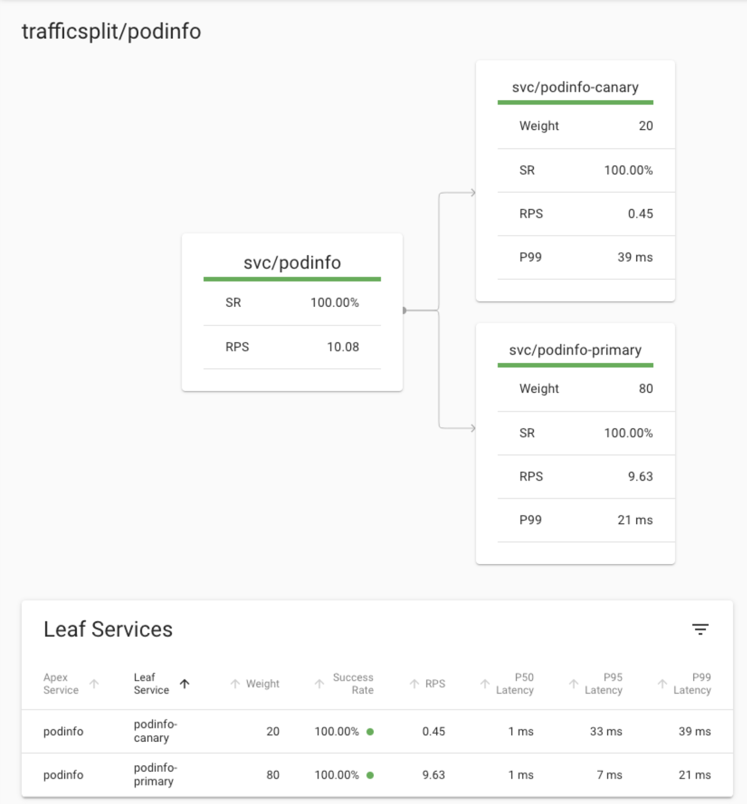

# linkerd-canary
Automated canary deployment


# Prerequisites
- Installed K8s cluster
- Installed Linkerd service mesh
- Installed Flagger

# Overview
Linkerd's traffic split feature allows you to dynamically shift traffic between services. 

This can be used to implement lower-risk deployment strategies like blue-green deploys and canaries.

While Linkerd will be managing the actual traffic routing, Flagger automates the process of creating new Kubernetes resources, watching metrics and incrementally sending users over to the new version.

## To configure Canary deployment with Linkerd we need to apply Canary definition to our cluster

* Step 1 - Create namespace
```
kubectl create ns test
```

* Step 2 - Install test application
```
kubectl apply -f example_app.yaml
```

* Step 3 - Install Canary definition
```
kubectl apply -f automated_canary_analysis.yaml
```

Next updating action will create canary pod, split traffic, and analaze metrics from prometheus.
In case if everything ok, it will update primary pod to the new version, and split 100% of traffic to the new primary pod.
Canary pod will be removed once new primary pod is running.


